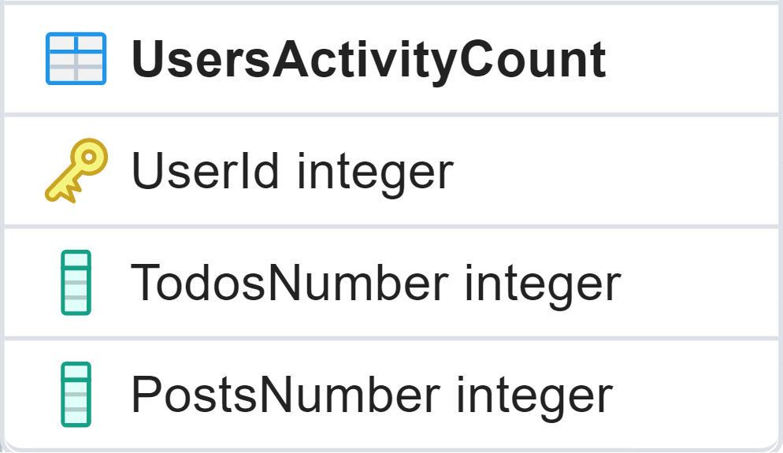

<strong>Challenge</strong>

Initial assumptions:&nbsp;

<ul>
	<li>The Database infrastructure is already created and contains 2 tables as described further in the document.</li>
</ul>

&nbsp;

<strong>Postgres SQL tables:&nbsp;</strong>

 

<strong>Overall project architecture:&nbsp;</strong>

<ul>
	<li>App1 and App2 communicates with Application Layer using a mediator pattern.</li>
	<li>Application defines all logic needed in the program.</li>
	<li>Application defines Interfaces to interact with external providers.</li>
	<li>Infrastruture&nbsp;provides the implementations of the interfaces that Application Layer requires.</li>
	<li>Domain provides all the data models to be used in communications accross the different layers.</li>
</ul>
